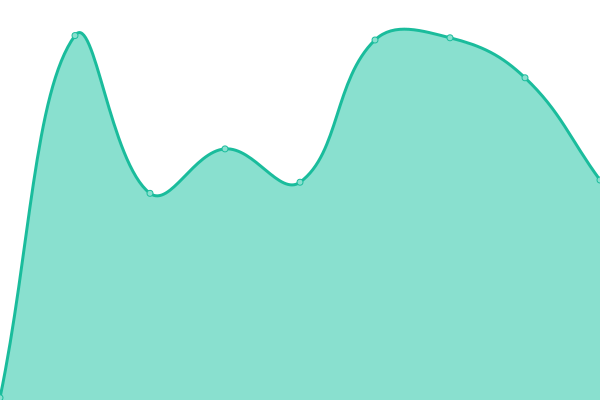

# [📈 Live Status](https://status.zeustanks.online): <!--live status--> **🟥 Complete outage**

<!--start: status pages-->
<!-- This summary is generated by Upptime (https://github.com/upptime/upptime) -->
<!-- Do not edit this manually, your changes will be overwritten -->
<!-- prettier-ignore -->
| URL | Status | History | Response Time | Uptime |
| --- | ------ | ------- | ------------- | ------ |
|  [Website](https://zeustanks.online) | 🟥 Down | [website.yml](https://github.com/ZeusTanks/ztanks-status/commits/HEAD/history/website.yml) | 

 0ms
     
 | 

<a href="https://status.zeustanks.online/history/website">0.00%</a>
    

|  Zeus Tanks server | 🟥 Down | [zeus-tanks-server.yml](https://github.com/ZeusTanks/ztanks-status/commits/HEAD/history/zeus-tanks-server.yml) | 

 0ms
     
 | 

<a href="https://status.zeustanks.online/history/zeus-tanks-server">0.00%</a>
    

<!--end: status pages-->

[**Visit our status website →**](https://status.zeustanks.online)
